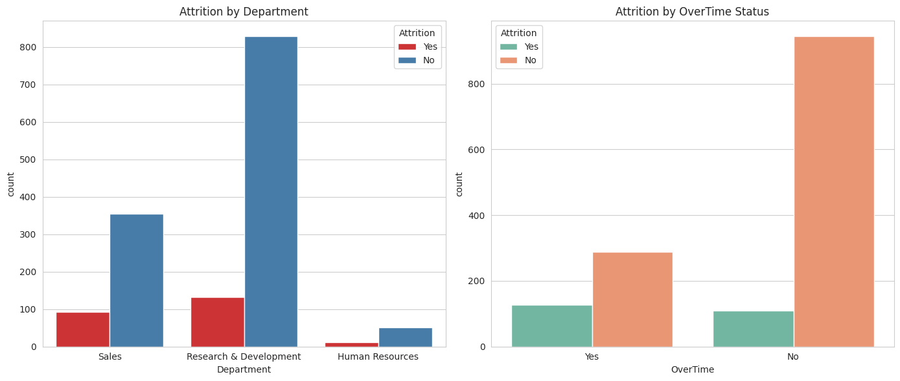
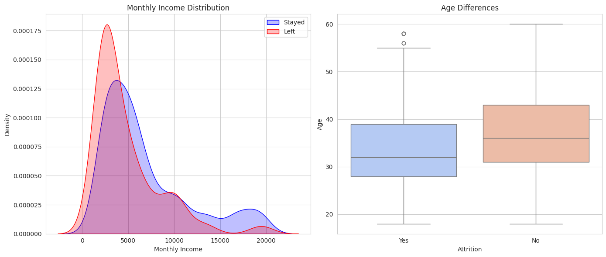

# Strategic Analysis of Employee Attrition using IBM HR Analytics Employee Attrition & Performance Dataset

## 📌 Project Overview
This project analyzes the **IBM HR Analytics Employee Attrition & Performance** dataset to identify the root causes of employee turnover. By processing 1,470 employee records, we identified that **Overtime ("Burnout")** and **Monthly Income** are the primary drivers of voluntary attrition.

**The Business Question:** *"Can we identify distinct risk profiles related to income, overtime, and job satisfaction to reduce turnover costs?"*
---

## 🔍 Key Findings

### 1. The "Burnout" Factor
Overtime is the single strongest predictor of attrition. Employees working overtime are over **3x more likely to leave** than those with standard hours.

### 2. The Income Gap
There is a statistically significant income gap between leavers and stayers.
* **Avg. Income (Stayed):** $6,832
* **Avg. Income (Left):** $4,787
* **Gap:** ~$2,045 per month

### 3. Risk by Job Role
Attrition is not uniform. It is concentrated in entry-to-mid-level roles, specifically **Sales Representatives** and **Laboratory Technicians**.

---

## 🛠 Methodology
* **Data Cleaning:** Removed redundant columns (`StandardHours`, `EmployeeCount`) to ensure statistical integrity.
* **Exploratory Data Analysis (EDA):** Visualized distributions of Age, Income, and Departmental churn.
* **Statistical Testing:**
    * **Correlation Matrix:** Identified `OverTime` ($r=0.25$) as the top risk factor.
    * **T-Test:** Confirmed the salary difference is statistically significant ($p < 0.05$).

---

## 📉 Recommendations
Based on the data, the following actions are recommended:
1.  **Overtime Cap:** Audit workload in R&D and Sales to reduce burnout-driven turnover.
2.  **Salary Adjustment:** Review compensation for Laboratory Technicians earning <$5,000/month.
3.  **Retention Program:** Implement mentorship for employees with <3 years of tenure.

---

## 📂 Repository Structure
* `IBM_HR_Analysis.ipynb`: The full Python analysis (Jupyter Notebook).
* `Images/`: Folder containing all visualization assets.
